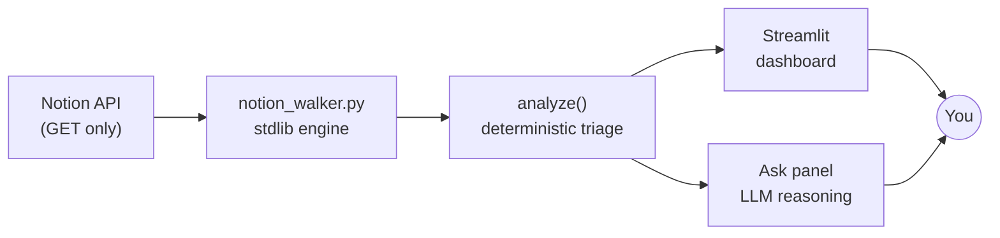

# 🌳 notion-triage

**A read-only intelligence layer over Notion task trees.**

Notion is excellent at *holding* tasks and poor at telling you which ones actually
need you today. `notion-triage` reads a Notion page's nested structure and turns it
into a prioritized action surface — what's overdue, what's weighted highest, and
what's quietly going stale — then lets a language model reason over the live tree
on demand.

It runs as a Streamlit dashboard, deploys to the cloud in minutes, and is built to
graduate into scheduled, semi-autonomous automation later.



---

## What it does

- **Surfaces deadlines intelligently.** Distinguishes real due dates (flagged with a
  "due" signal) from incidental dates like creation stamps, so a logged date never
  masquerades as an overdue task.
- **Ranks by weighted priority tiers.** Configurable tiers (default `A1000 > B1000 >
  C1000`) let you assign importance weights and see the top of your list at a glance.
- **Flags lingering work.** Reads Notion's own last-edited timestamps to catch tasks
  that have sat untouched past a threshold — the ones that silently rot.
- **Answers questions about your tree.** An LLM "Ask" panel reasons over the live
  data: *"what should I focus on before Friday?"* — citing the exact branch each task
  lives under.
- **Handles multiple workspaces.** Each Notion source becomes its own tab, with an
  independent dashboard and chat.

---

## Design principles

The interesting part isn't that it talks to an LLM — it's the restraint in *where* it does.

- **Read-only, always.** The engine issues nothing but HTTP `GET`. It has no create,
  update, or delete code paths, and the Notion connection itself is scoped to read-only.
  Two independent guarantees that the source tree can never be altered — a hard
  requirement born from past experience with programmatic writes corrupting a tree.
- **Deterministic floor, model ceiling.** Everything that *can* be a fast, free, exact
  rule — date parsing, priority matching, staleness — is a rule. The language model is
  reserved for genuine judgment (open-ended questions, later: pattern-spotting). No
  tokens are spent on work a string comparison nails.
- **Agentic only where it earns its place.** The Ask panel today is honestly a
  well-fed chatbot, not an agent — and that's the correct floor for a tree this size.
  The upgrade to model-chosen tool use is deliberately deferred until the data outgrows
  a single context window, with a clean seam left for exactly that.
- **Stdlib-first.** The core engine has zero third-party dependencies — just Python's
  standard library — keeping it portable enough to later drop onto a Raspberry Pi.

---

## Architecture

A clean two-part split with one seam between them:

| Component | Role | Dependencies |
|---|---|---|
| `notion_walker.py` | Reads the tree, produces triage buckets. Importable *and* runnable standalone (CLI + offline self-test). | Standard library only |
| `app.py` | Streamlit UI: per-source dashboards + Ask panels. | Streamlit, Anthropic SDK |

The walker knows nothing about the web UI, and the UI knows nothing about HTTP — it
just consumes structured buckets. That separation is what lets the same engine power a
Streamlit dashboard today and a scheduled cron job on a Raspberry Pi tomorrow, with no
rewrite.

---

## Tech stack

- **Language:** Python 3.12
- **Data source:** Notion API (block-tree traversal, cursor pagination)
- **Frontend / hosting:** Streamlit → Streamlit Community Cloud
- **LLM:** Anthropic Claude (model-selectable; Sonnet by default)
- **Engine:** Python standard library (`urllib`, `re`, `datetime`) — no heavy deps
- **Config:** Streamlit secrets in the cloud; `.env` / secrets file locally
- **Dev workflow:** WSL Ubuntu + Conda → GitHub → Streamlit Cloud

---

## Running it locally

```bash
conda activate ai-agents            # or any Python 3.12 env
pip install -r requirements.txt

# provide credentials (see .streamlit/secrets.toml.example)
streamlit run app.py                # → http://localhost:8501
```

Each source needs a Notion internal connection with the target page shared to it, plus
its token and page id in secrets. An `ANTHROPIC_API_KEY` activates the Ask panel; without
it, the deterministic dashboard still works fully.

Quick engine sanity check, no network required:

```bash
python3 notion_walker.py --selftest
```

---

## Roadmap

- **Agentic Ask panel** — give the model retrieval tools (`search_tree`,
  `get_subtree`, `list_overdue`) and let it drive multi-step lookups, for when trees
  grow past a single context window.
- **Weekly pattern-spotting** — an LLM pass over history surfacing trends a rule can't
  ("this tier never gets done — batch it or drop it").
- **Scheduled morning brief** — the same engine on a Raspberry Pi via cron, delivering a
  daily digest over Telegram / email.
- **Richer priority weighting** — additional tiers and cross-branch dependency awareness.

---

*Built as part of a broader personal automation system — a set of small, isolated,
cost-conscious tools that each earn their complexity.*
